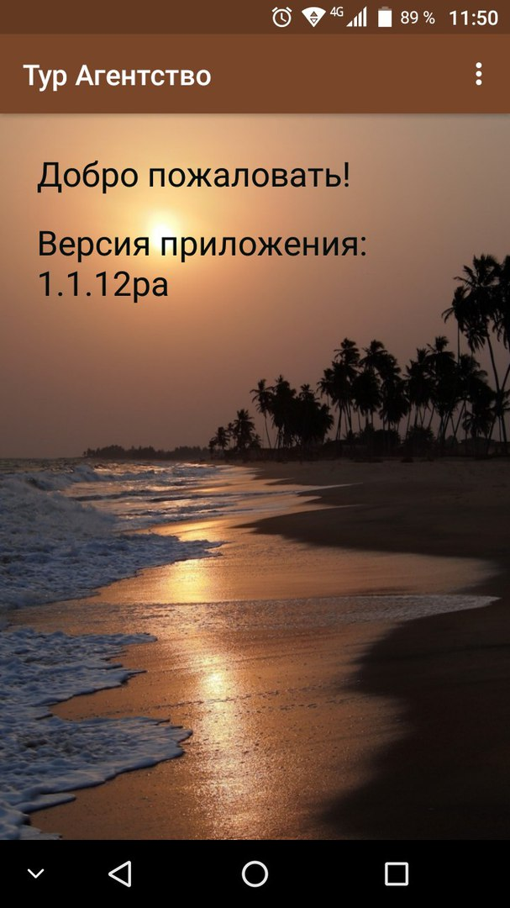
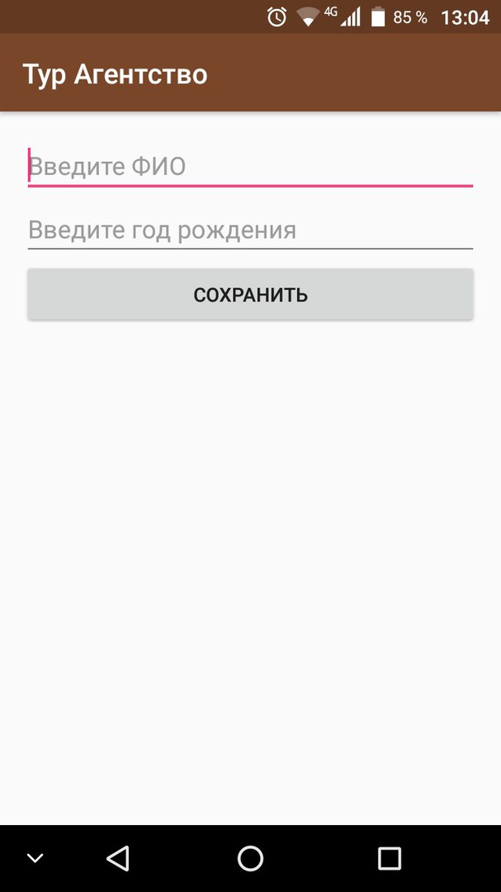
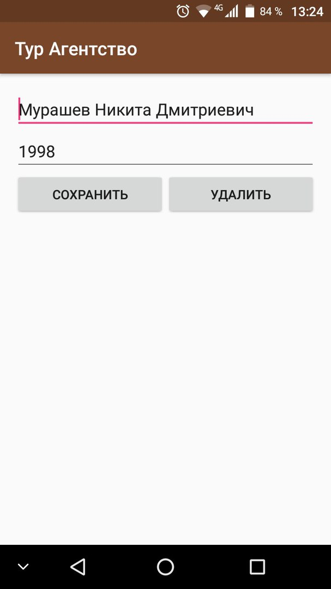

Руководство пользователя
========================

Для начала работы с мобильным приложением «Тур Агентство», необходимо зайти в меню приложений и нажать на иконку приложения «Тур Агентство».

На главном меню представлено окно приветствия и версия приложения. 

В правом верхнем углу окна приложения находится кнопка всплывающего меню. При нажатии на нее отобразятся две кнопки «Таблицы» и «Выход».

.. figure:: _static/2.jpg
       :align: center

Если нажать на кнопку «Выход», то приложение завершит свое выполнение, и мы окажемся на основном окне телефона. 
Если нажать на кнопку «Таблицы», то откроется новое окно со списком существующих таблиц в приложении.

.. figure:: _static/3.jpg
       :align: center

В окне таблиц у нас также имеется в верхнем правом углу кнопка всплывающего меню, при нажатии на которую появится кнопка возврата к главному меню.

.. figure:: _static/4.jpg
       :align: center

Окно таблиц содержит в себе 5 кнопок различных таблиц. Это кнопки «Турист», «Экскурсии», «Гостиницы», «Виза», «Группа туристов». Каждая таблица содержит в себе записи, относящиеся к ней.
При нажатии на кнопку «Турист», мы перейдем к таблице туристов, в которой содержатся записи туристов. В центре в верхней части экрана имеется кнопка «Добавить», при нажатии на которую открывается новое окно.

В данном окне имеются поля для заполнения информацией о туристе. В первое поле вводится фамилия, имя и отчество. Во второе поле вводится его дата рождения. После ввода информации необходимо нажать кнопку «Сохранить». Вся введенная информация сохранится и откроется таблица туристов с уже добавленной записью.

.. figure:: _static/4.jpg
       :align: center
       
Мы можем выбрать любую из существующих записей и нажать на нее. Откроется окно редактирования записи.

В данном окне имеется 2 поля, как и в создании записи. В первом поле введены фамилия, имя и отчество, а во втором дата рождения. Мы можем нажать на любое из полей и отредактировать запись, изменив нужную нам информацию. 
Ниже полей редактирования расположены 2 кнопки «Сохранить» и «Удалить». 
Если мы нажмем на кнопку «Сохранить», то измененная информация сохранится и нам откроется таблица туристов с измененной записью.
Если мы нажмем на кнопку «Удалить», то данная запись со всей содержащейся в ней информацией удалится и откроется таблица туристов, в которой этой записи уже не будет.

.. figure:: _static/4.jpg
       :align: center

Чтобы выйти из таблицы «Туристы», необходимо нажать кнопку «Назад» в нижней части экрана расположенной на панели или на экране телефона. После чего у нас откроется окно таблиц, в котором мы можем перейти к любой таблице. Оставшиеся 4 таблицы, находящиеся ниже таблицы «Туристы» реализованы аналогичным образом и содержат точно такой же функционал, но с измененным названием полей в создании и редактировании записи.
